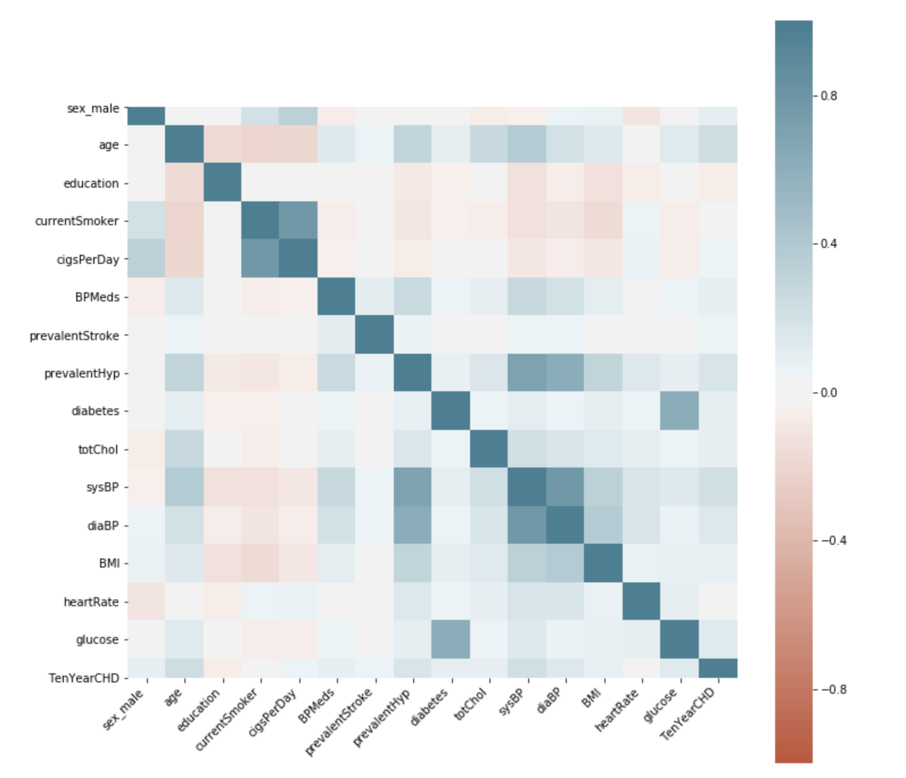
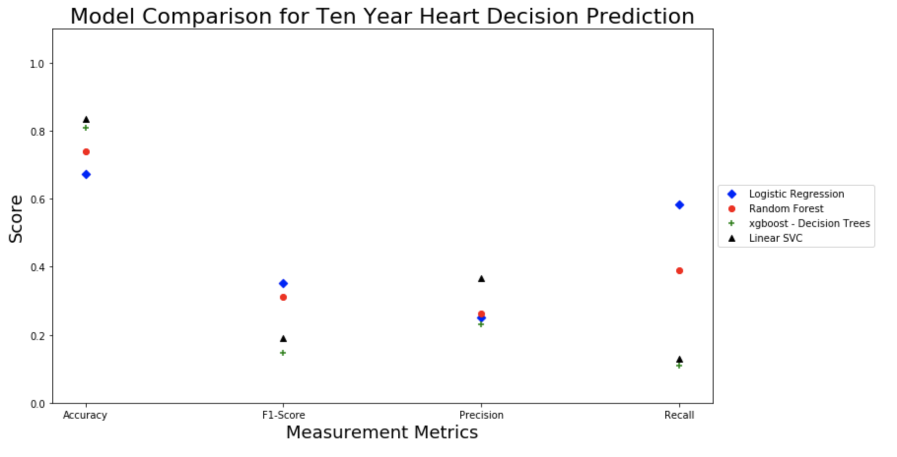
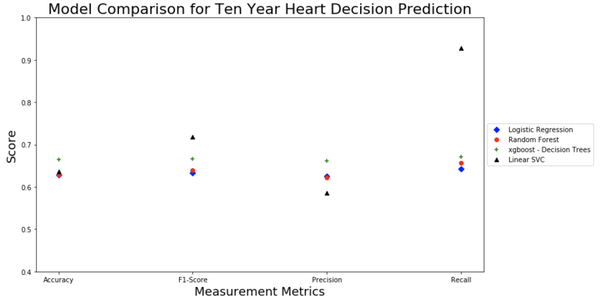

# CardioRiskScore
A Ten Year CHD Risk Score study on Framingham Hear Dataset using multiple machine learning techniques
- [jupyter notebook - Over Sampling](https://ndesai187.github.io/assignment_2_ndes8735_syntheticSampling.html)
- [jupyter notebook - Under Sampling](https://ndesai187.github.io/assignment_2_ndes8735_underSampling.html)

## Table of contents

- [Goal](#goal)
- [Heatmap](#heatmap)
- [Predictor Imbalance](#classimbalance)
- [Sampling Techniques](#samplingtechniques)
- [Modeling Approach](#modellingapproach)
- [Results](#results)

  
## Goal
As per the World Health Organization report, an estimated 18 million people died from Cardiovascular Disease in 2016. This figure represents 31% of all global deaths. Also, the WHO studies state that cardiovascular diseases can be detected based on other risk factors such as hypertension, diabetes, irregular blood pressure etc. One of the leading ongoing research in this area is conducted by “Framingham Heart Study” since 1948.

Framingham dataset contains number of features such as Diabetes, BP Medications, Glucose levels, and age etc. It also has a Ten Year Cardiovascular Heart Disease score (CHD) for selected patients. Our study focuses on a question:

- Can we successfully predict a patients risk for contracting cardio vascular disease based on their vitals such as Diabetes condition, BP Medications, Glucose levels, and age etc?

## Heatmap

  
   
  <i>Feature Heatmap for Framingham Heart Dataset</i>

## Class Imbalance 
- The number of positive cases of risk score are far lower than negative cases.
- Due to class imbalance, we cannot rely on a generic accuracy reading to measure model effectiveness. The negative cases are 85% of samples, and thus a simply assigning negative value to all test sample can give us 85% accuracy. To avoid this fallacy, we will use f1-score, precision and recall measurement to evaluate our model.

  - True Positive – A patient with no CHD risk tagged with score 0.
  - True Negative – A patient with CHD risk tagged with score 1.
  - False Positive/False negative – A patient misclassified with CHD score.

## Sampling Techniques
1. Under sampling: This method will make sure than we have equal samples of positive and Negative cases to train and test from actual dataset.
2. Over sampling: This method creates synthetic positive cases to equalize training samples for modeling. We will use SMOTE python library in our modeling to model using over sampling. It defers from under sampling in two ways:

  - The actual training samples are much more in case of synthetic sampling.
  - The synthetic sampling "generates" training data from existing samples. It doesn't represent actual samples and may not give desired results.

## Modelling Approach
The following models were implemented and cross checked against the benchmark logistic regression :
1. Classification using Random Forest
2. Decision Trees with Extreme Gradient Boosting (XGBoost)
3. Support Vector Machines

The following approach was taken during the study:
1. After feature selection, each feature was pre-processed either with one hot encoding or standardization technique based on type of data.
2. The selected models were hyper tuned using 10 fold cross-validation.
3. Each model was tested based on best hyper parameters and verified as per the evaluation measure described.
4. Both oversampled and under sampling tests were performed using train/test split of 75% and 25% respectively.

## Results
- Under sampling gives reliable results with all models. The XGBoost based decision tree performed better than benchmark logistic regression model. The F1-score on XGBoost was best at 66%.

  
   
  <i>Oversampling Model Comparison</i>

  
   
  <i>Undersampling Model Comparison</i>

